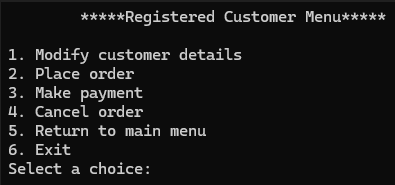

# Shop ordering system

This is one of my first C project, it is a simple system which uses the command line as its interface for the program. This project aims to help me learn more about low level programming like memory management, pointers, file I/O operations, etc. Text files was used to act as the database for the program. Below shows a demo of the project.

 

    

 

    

 

    

